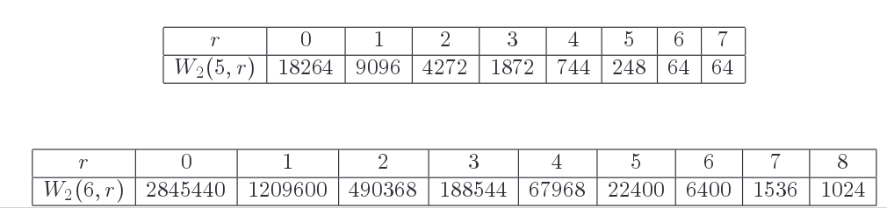
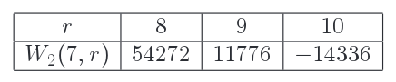
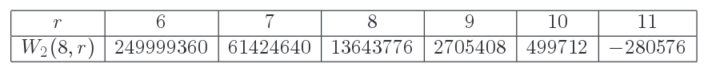
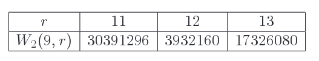

.. open_fixedpoint_formula documentation master file, created by
   sphinx-quickstart on Wed Mar 14 12:01:15 2018.
   You can adapt this file completely to your liking, but it should at least
   contain the root `toctree` directive.

Welcome to the Open Fixed-point Formula documentation!
======================================================

What this program is trying to achieve
--------------------------------------

This program provides an implementation of the Open Fixed-point Formula (OFP) computing the open Gromov-Witten invariants of :math:`\mathbb{R}P^2 \hookrightarrow \mathbb{C}P^2`. We've used it as a sanity check of the formula, as we will explain below.

For a proof of the OFP and detailed definitions, see  `arXiv:1703.02950 <https://arxiv.org/pdf/1703.02950.pdf>`_. We hope that the extended documentation and the comments added to the body of the code will help make this into a gentle introduction to the ideas of open fixed point localization and serve as a companion to the paper, unwinding the rather terse mathematical discussion there.

The main function is :py:func:`evenOddTrees.OGW`. For a tuple of non-negative integers :py:obj:`(d,l,k)` with

* :py:obj:`d` the total degree :math:`\in \mathbb{Z} = H_2(\mathbb{C}P^2,\mathbb{R}P^2)`,

* :py:obj:`l`, the total number of interior markings, 

* :py:obj:`k`, the total number of boundary markings

:py:func:`evenOddTrees.OGW` computes the equivariant extended integral

.. math::
    :label: invariants

    OGW(d,l,k) := \int_{\mathfrak{b}} \omega

where :math:`u` is the generator of :math:`H_{S^1}^*(pt) = \mathbb{R}[u]` and :math:`\omega` is the pullback of an :math:`S^1` -equivariant form Poincare dual to a point in :math:`(\mathbb{C}P^2)^l \times (\mathbb{R}P^2)^k` (we will specify it more precisely shortly).

In the non-equivariant limit :math:`u = 0`, :eq:`invariants` reduces to an ordinary integral on the moduli space of disks,

.. math::
    :label: nonequiv_inv

    OGW(d,l,k) = \int_{\overline {\mathcal{M}}_{0,k,l}(d)} \omega_0,

where :math:`\omega_0` is the pullback of an ordinary differential form Poincare dual to a point in :math:`(\mathbb{C}P^2)^l \times (\mathbb{R}P^2)^k`. We have

.. math::
   :label: welschinger

   OGW(d,l,k) = 2^{1-l} \cdot W_2(d,l) \mbox{ when } 3\,d-1 = 2\,l+k,

where :math:`W_2(d,l)` is Welschinger's signed count of degree d real curves through a generic configuration of :math:`k = 3\,d-1-2\,l` points in the real plane and :math:`l` conjugation invariant pairs of points in the complex plane.

We've used this program as a sanity check for the fixed-point formula, in two ways. First, by comparing to known Welschinger counts and second, by verifying that the under-determined invariants vanish. We now explain both of these tests.

**Computing Welschinger Counts**

We've used this program to compute all non-equivariant invariants of degree :math:`\leq 6` and verified these agree with Welschinger's counts, which are well-known. See for example the tables on page 17 of Arroyo, Brugalle and De Medrano's `paper <http://erwan.brugalle.perso.math.cnrs.fr/articles/W2/W2Irred.pdf>`_.

Here are a couple of examples, which take about a minute each on my computer

>>> OGW(6,0,17)
-5690880

>>> OGW(6,8,1)
-8

The function :py:func:`evenOddTrees.W2` is a simple wrapper for :py:func:`evenOddTrees.OGW` that computes the Welschinger invariants. Here are some lengthier runs computing all of the degree 5 and degree 6 invariants, as well as the "top" invariants in degrees 7,8 and 9

>>> W2(7,10)
14336

>>> W2(8,11)
-280576

>>> W2(9,13)
17326080

>>> for r in range(8+1) :
...     print("W2(6,{}) = {}".format(r,W2(6,r)))
... 
W2(6,0) = -2845440
W2(6,1) = 1209600
W2(6,2) = -490368
W2(6,3) = 188544
W2(6,4) = -67968
W2(6,5) = 22400
W2(6,6) = -6400
W2(6,7) = 1536
W2(6,8) = -1024

>>> for r in range(7+1) :
...     print("W2(5,{}) = {}".format(r,W2(5,r)))
... 
W2(5,0) = -18264
W2(5,1) = 9096
W2(5,2) = -4272
W2(5,3) = 1872
W2(5,4) = -744
W2(5,5) = 248
W2(5,6) = -64
W2(5,7) = 64

so you can easily compare with the values

appearing in the paper cited above.

The following quick (but still non-trivial) computations verify that there's a single real line (or pair of degree one holomorphic disks) through any two real points, and a unique conic through every 5 points:

>>> OGW(1,0,2)
-2
>>> OGW(2,0,5)
-2

.. _vanishing-invts:

**Computing Vanishing Invariants**

From the definition, we expect under-determined invariants (coefficients of :math:`u` to a negative power) to vanish. In practice, the formula involves integrals over fixed-point components, which may have much lower dimension than the total space. Thus, we obtain non-trivial relations which can be used to test the validity of the formula. For example

>>> OGW(4,0,3)
0

as expected, but if you uncomment the two "print(...)" lines in the code of :py:func:`evenOddTrees.superPotential` and compute the invariant again, you'll see that this zero is obtained as the following sum:

-1 + 1/6 + 1/12 + -1/8 + 1/6 + 10/9 + -8/3 + 1/12 + -1/8 + 1/12 + -1/8 + 1/6 + 10/9 + 1/12 + -1/8 + 10/9.

**Integrality of Equivariant Invariants**

We can also compute the (rather unexplored) equivariant invariants:

>>> OGW(2,4,9)
1416*u**6

Although a-priori :math:`OGW(d,l,k) \in \mathbb{Q}[u]`, in all the cases we checked we in fact have :math:`OGW(d,l,k) \in \mathbb{Z}[u]`, and we conjecture this is always the case. We emphasize that the fixed-point contributions are not, generally speaking, integral, so the fact the end result is an integer is another indication that we're computing things correctly.

.. _conj-invariance:

Scope of program, conjugation invariance condition
--------------------------------------------------

Recall that the fixed-point formula in `arXiv:1703.02950 <https://arxiv.org/pdf/1703.02950.pdf>`_ applies to any extended equivariant form :math:`\omega = \{\omega_r\}` defined on the moduli spaces of holomorphic discs mapping to :math:`\mathbb{R}P^{2m} \hookrightarrow \mathbb{C}P^{2m}`. When we specialize to the case :math:`\omega` is defined by pulling back equivariant forms along the boundary and interior evaluation maps,

.. math::

   \omega_r = \prod \operatorname{evi}_i^* \mathcal{H}^{d_i} \;\prod \operatorname{evb}_j^* p_0^L

it becomes a tractable combinatorial recipe for computing the equivariant open Gromov-Witten invariants. Here :math:`\mathcal{H}` is any form representing the equivariant hyperplane class :math:`\in H^2_{S^1}(\mathbb{C}P^2)` and :math:`p_0^L` is any form representing the point class :math:`\in H^2_{S^1}(\mathbb{R}P^2;\det \mathbb{R}P^2)`.

This program, however, focuses on the special case :math:`m = 1`, :math:`d_i = 2` for all interior markings, and we assume that :math:`\mathcal{H}^2` is represented by a conjugation invariant form whose support does not intersect :math:`\mathbb{R}P^2`. In other words, if we denote by :math:`\{p_+,p_-,p_0\} \subset \mathbb{C}P^2` the :math:`S^1` fixed points, with :math:`p_0 \in \mathbb{R}P^2` the unique real fixed point, then we have an equality of cohomology classes 

.. math::

   \mathcal{H}^2 = \frac{1}{2}([p_+] + [p_-])

and we assume that the form representing this class is supported in a pair of balls around :math:`p_\pm`, so small that they don't intersect the real plane.

We make this assumption because it is only this sector of the invariants that is relevant to the comparison with the Welschinger counts. In his pioneering `thesis <https://arxiv.org/abs/math/0606429>`_, Jake defined a relative orientation on the moduli spaces of disks, and computed the sign of the conjugation action. This was used there to define open Gromov-Witten invariants (in the classical, conjugation-invariant sector) and establish the relationship with Welschinger's counts. 

As it turns out, working in the conjugation-invariant sector allows us to discard many diagrams due to similar sign-of-conjugation considerations, so it also gives a computational boost [#booster]_. But other than that, there's no reason why this program cannot be extended to compute general equivariant invariants. In fact, we've used a separate Sage program to compute some OGW invariants for :math:`\mathbb{R}P^{2m} \hookrightarrow \mathbb{C}P^{2m}` with :math:`m > 1`, and checked the under-determined invariants vanish as expected (this is an equality of rational functions in :math:`m` indeterminates, the localization of :math:`H^*_{U(1)^m} (\mbox{pt}) = \mathbb{R}[u_1,...,u_m]`).

.. [#booster] In Jake's thesis, the sign of conjugation was used to show that boundaries which would otherwise make the invariant ill-defined cancel in pairs. The same argument shows that the extended integral :eq:`invariants` reduces to :eq:`nonequiv_inv` for the classical invariants, when :math:`u = 0`. But once we either (i) consider equivariant invariants or (ii) consider deformations of the integrand which are not pulled back along the evaluation maps, such as those used to establish the fixed-point formula, then this argument breaks down, and we start seeing contributions from the (resolutions of) the boundary and corners of the moduli space. Still, this argument does show many of these contributions vanish (in fact, only about :math:`\left(\frac{1}{2}\right)^c` of the codimension :math:`c` corners do *not* vanish), giving the computational boost we mentioned.

   Let us mention that we could speed things up even more by discarding diagrams where interior markings are placed on vertices which map the real fixed point :math:`p_0` (since :math:`\mathcal{H}^2` is supported away from :math:`p_0`), but this is not implemented in this version.

Table of Contents
-----------------

.. toctree::

   self

.. toctree::
   :maxdepth: 2

   overview
   evenOddTrees
   weighted_fp_contribs
   fixedPoints+pincher 
   reiterators+treeReiterator
   utilities+jrr+dlkp

Indices and tables
==================

* :ref:`genindex`
* :ref:`modindex`
* :ref:`search`
