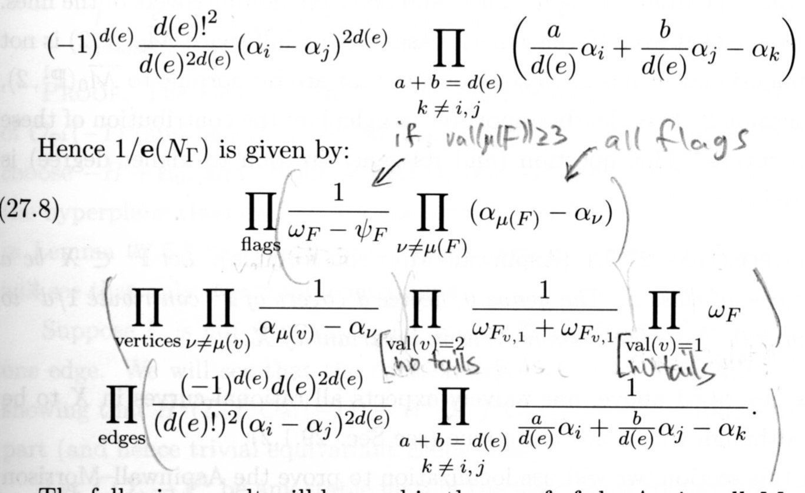

The weighted_fp_contribs module
===============================

The purpose of this module is to compute the fixed-point contributions to a single even-odd diagram vertex factor.

Recall (see :eq:`fpf-concise`) that the open fixed-point formula is a sum of products of factors of the form :math:`C_v = \sum A_{\tilde F}`. There's such factor :math:`C_v` for each vertex :math:`v` of an even-odd diagram. The main function of this module, :py:func:`weighted_fp_contribs.weighted_fpContrib`, computes the contribution :math:`C_v` of such a vertex, so let us now explain what this contribution is.

Notation
--------

Write :math:`(X,L) = (\mathbb{C}P^2,\mathbb{R}P^2)`. The circle group :math:`S^1` acts on this pair by rotations around an axis which intersects :math:`L` at the origin :math:`p_0`. :math:`X` has two additional fixed points, denoted :math:`p_+,p_-`. The circle action on :math:`X` can be extended to an action of the torus group :math:`T^2`. The circle and torus fixed points in :math:`X` are the same, but the torus action does significantly simplify the space of closed holomorphic maps into :math:`X`, which will be useful to us. Anyway, we have two degree two generators for the equivariant cohomology ring

:math:`H^*_{T^2} = \mathbb{R}[u,\epsilon]`

(in the code, :math:`\epsilon` is called :py:obj:`eps`), chosen so that pullback along :math:`B S^1 \to B T^2` is given by :math:`\epsilon \mapsto 0` and :math:`u \mapsto u`.

We denote the moduli spaces of stable disk-maps by :math:`\overline{\mathcal{M}}_{0,k,l}(d)`. It acquires an :math:`S^1` action from the action on the pair :math:`(X,L)`.

The vertex factor as a weighted sum of fixed-point contributions
----------------------------------------------------------------

Let us focus, then, on some vertex in an even-odd diagram. The relevant information from the even-odd diagram is summarized by a four-tuple :py:obj:`(d,l,k,e)` where 

* :py:obj:`d` is the relative degree of the vertex :math:`\in H_2(X,L)`

* :py:obj:`l` is the number of interior markings (which always carry the equivariant point constraint :math:`\frac{1}{2}\left([p_+] + [p_-]\right)`

* :py:obj:`k` is the number of boundary markings PLUS the number of incoming edges; it should only be nonzero if :py:obj:`d` is even (there are no fixed points otherwise, function will return zero).

* :py:obj:`e` is the number of outgoing edges. This should only be nonzero if :py:obj:`d` is odd. This is the result of resummation of the even-even edges (see Section 6 of `arXiv:1703.02950 <https://arxiv.org/pdf/1703.02950.pdf>`_), which leaves only edges oriented from an odd to an even vertex (and recovers the Pandharipande-Solomon-Tessler boundary condition).

We're interested in computing 

.. math::
   :label: fpf-S1

   C_v = \sum_F \xi_F \int_F \frac{\omega|_F}{e^{S^1}(N_F)}.

(cf. Remark 31 in `arXiv:1703.02950 <https://arxiv.org/pdf/1703.02950.pdf>`_). Here :math:`F` ranges over connected components of the :math:`S^1` -fixed points of :math:`\overline{\mathcal{M}}_{0,k,l}(d)`, :math:`\omega` is the extended form whose integral gives the OGW invariants, and :math:`e^{S^1}(N_F)` is the equivariant Euler form of the normal bundle associated with the map :math:`F \hookrightarrow \overline{\mathcal{M}}`. So this is very much in tune with the classical fixed point formula for spaces without boundary, except here we see that the contribution of each fixed point is "weighted" by a factor :math:`\xi_F`, which comes from integrating a certain propagator :math:`\Lambda` along the fiber of the map forgetting the markings associated with the outgoing edges. See :math:`\S 3.3`, and in particular Lemma 28, of `arXiv:1703.02950 <https://arxiv.org/pdf/1703.02950.pdf>`_.

If :math:`d` is even, we have only incoming edges so :math:`\xi_F \equiv 1`. But if :math:`d` is odd, we have 

.. math::

   \xi_F = \left(\frac{\pm d(F)}{2\,u}\right)^e

where :math:`d(F)` is the degree of the irreducible disk component (in this case, :math:`k=0`, so we consider the fixed points of :math:`\overline{\mathcal{M}}_{0,0,l}(d)`, and the formula only knows about the number of outgoing edges through the weights).

Circle vs. Torus fixed points
-----------------------------

In :eq:`fpf-S1` we considered the connected components of :math:`S^1` -fixed point :math:`F \subset \overline{\mathcal{M}}_{0,k,l}(d)`. The spaces :math:`F`, are, however, somewhat complicated, since the associated maps need not be rigid. This phenomena is discussed in Remark 9 of `arXiv:1703.02950 <https://arxiv.org/pdf/1703.02950.pdf>`_. See also :py:mod:`pincher` for more details about the geometry of the non-rigid maps.

For our purposes, it is enough to note that *the fixed point components F are equipped with an extended torus* :math:`T^2` *action*. Indeed, this action fixes the irreducible disk components of the domain, and acts act on the remaining closed irreducible components by using the :math:`T^2` -action on :math:`X`. Since the closed components are attached to the disk components at points of :math:`X` which are fixed by the :math:`S^1` action, and hence also by the :math:`T^2` action, this is well-defined.

The upshot is that

.. math::

   \int_F \frac{\omega|_F}{e^{S^1}(N_F)} = \sum_{\tilde F} \int_{\tilde F} \frac{\omega|_{\tilde F}}{e^{T^2}(N_{\tilde F})}

where now :math:`\tilde F` ranges over the :math:`T^2` fixed points inside :math:`F = F(\tilde F)`. Setting :math:`A_{\tilde F} = \xi_{F(\tilde F)} \int_{\tilde F} \frac{\omega|_{\tilde F}}{e^{T^2}(N_{\tilde F})}` we obtain :eq:`fpf-concise`. 

We see that to specify a :math:`T^2` fixed point component we need to:

(a) give some discrete data describing the behavior of the disk component(s).

(b) specify a :math:`T^2` fixed-point component of a *closed* moduli space.

The closed :math:`T^2` fixed points have been extensively studied, and admit a simple description in terms of certain labeled trees. Throwing in the disk data we arrive at *fixed point diagrams*. These are generated by the module :py:mod:`fixedPoints`, and you can look there for more details about the geometry of the fixed points.

Each :math:`A_{\tilde F}` is a rational function in *two* equviariant variables, :math:`u` and :math:`\epsilon`. Generally speaking, :math:`A_{\tilde F}` will have a singularity at :math:`\epsilon = 0`. These singularities correspond to the :math:`S^1` fixed sub-bundle :math:`N_{\tilde F}^{F} \subset N_{\tilde F}^{\overline{\mathcal{M}}}`. It is another indication that we're computing things correctly that if we fix some :math:`S^1` fixed point component :math:`F`, the sum :math:`\sum_{\{\tilde F | F(\tilde F) = F\}} A_{\tilde F}` 
is regular at :math:`\epsilon = 0`. 

In fact, to avoid enormous denominators, it is necessary to cluster the :math:`T^2` contributions by their associated :math:`S^1` fixed points and evaluate at :math:`\epsilon = 0` as soon as possible. The module :py:mod:`pincher` implements a function :py:func:`pincher.pinch` which sends each fixed point diagram to another *totally pinched* fixed point diagram, which uniquely represents the *circle* fixed-point (in other words, 
:py:obj:`pinch(fp1) == pinch(fp2)` iff :py:obj:`fp1` and :py:obj:`fp2` belong to the same :math:`S^1` fixed point component). 

The formula for the inverse Euler
---------------------------------

We want to discuss the computation of the inverse Euler form in :py:func:`weighted_fp_contribs.fpModuliAndEuler`.

For a justification (and precise definition) of the Euler form used here, see the proof of Proposition 32 in `arXiv:1703.02950 <https://arxiv.org/pdf/1703.02950.pdf>`_ and the discussion leading up to it. Here we will give a more informal, computationally oriented review. We will assume the reader is familiar with the formula in the closed case:

This is taken from pg. 545 of the freely available `book on Mirror Symmetry <http://www.claymath.org/library/monographs/cmim-1.pdf>`_ (we've penciled-in some notes to aid in interpreting the formula, but see the book for full details). 

We essentially follow this formula, and use the same terminology (e.g. we refer to the "flags", "vertices" and "edges" terms in the code; and we use similar indices and variables whenever possible). 

The main difference is that we have an additional factor coming from deformations of the irreducible disk component. If the total degree is odd, this is essentially a square root of the edge term on the last line we would've obtained if were to double the disk component. If the total degree is even, the disk component is contracted. In this case there's an additional "vertex-like" factor (second line) corresponding to moving the disk *inside* :math:`L`, as well as additional "flag-like" factor (first line) corresponding to the complex nodes attached to the disk component. 

Each node carries a :math:`T_{p_0}X` constraint factor, as well as a smoothing-deformation factor of the form :math:`\psi_i - \omega_i`, exactly as for a complex node between two rational components (one of which is contracted). The key point is that now :math:`\psi_i` lives on the manifold *with corners* :math:`\overline{\mathcal{M}}_{0,k,l}` parameterizing the contracted component. Thus we need to specify boundary conditions if we want to make sense of integrals of products of such :math:`\psi`'s. The fixed-point formula dictates a natural boundary condition, and it turns out to agree with the boundary condition used by Pandharipande Solomon and Tessler in developing the `intersection theory of disks <https://arxiv.org/abs/1409.2191>`_. The module :py:mod:`jrrFormula` implements their elegant formula for the descendent integrals of disks in genus zero, and we use it when integrating the inverse Euler in :py:func:`weighted_fp_contribs.fpContrib`.

We note that the formula above is written using a symmetric (but degenerate) action of the rank 3 torus :math:`T^3` on :math:`X` with weights :math:`\alpha_0,\alpha_1,\alpha_2`. The action of :math:`T^2` we're interested in factors through this action, the relevant substitutions are discussed in a comment in the code.

Documentation from Docstrings
-----------------------------

.. automodule:: weighted_fp_contribs
   :members:
   :undoc-members:
